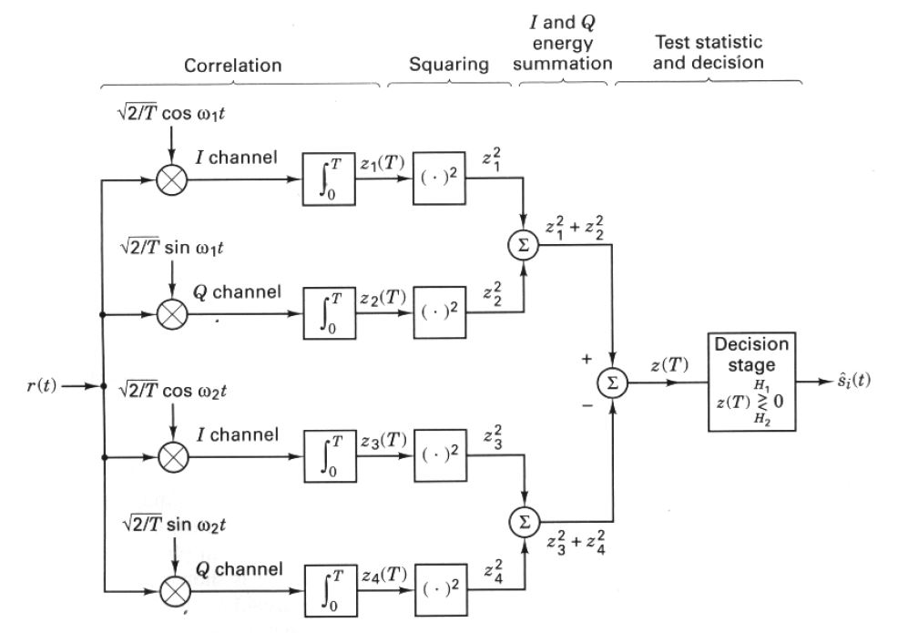

# FSK-Modulation-Demodulation
Frequency Shift Keying Moduation and Demodulation implementation in MATLAB

## FSK Demodulation
Non Coherent FSK Detection using Quadrature Receiver



## Noise

MATLAB function used for adding noise to signal for simulating recieved 
Signal.
Adds white Gaussian noise to signal. Varying Noise has been added to the signal 

```
awgn
```

