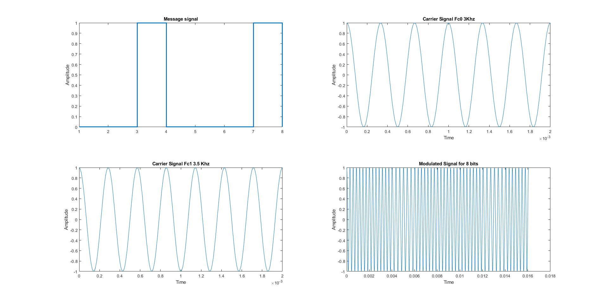
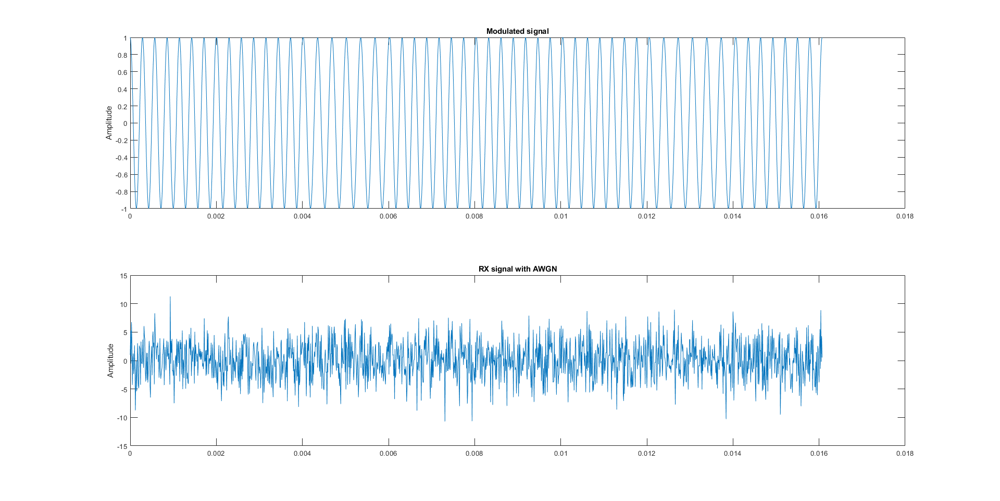
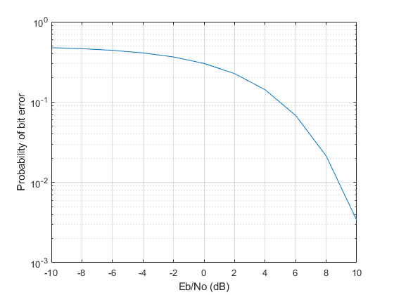
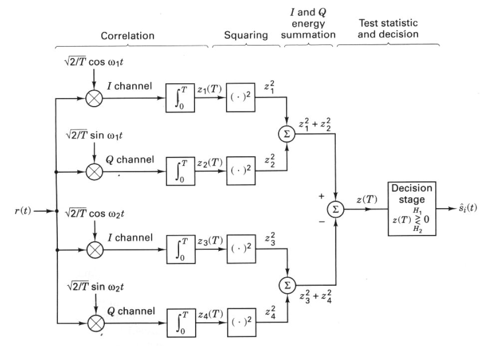
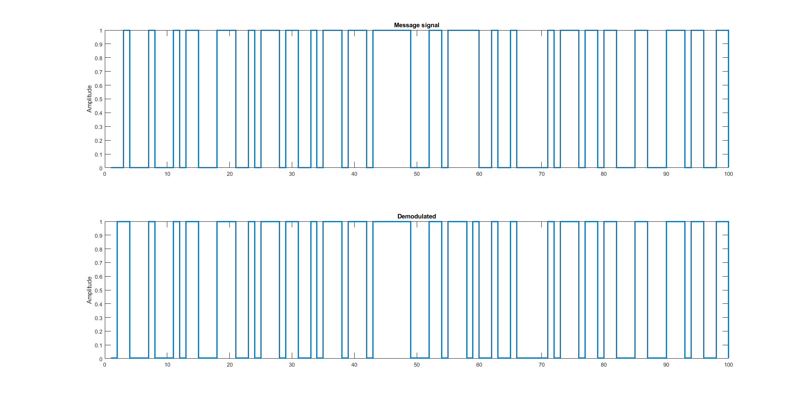

# FSK-Modulation-Demodulation
Frequency Shift Keying Moduation and Demodulation implementation in MATLAB for Digital Communications Course at New York Institute of Technology

## Random Signal Generation and Modulation
Random binary signal generation has been done by using MATLAB's function ;

```
x = randi([0 1],Noit,1);
```
Noit represents legnth of Signal

### Modulated Signal Plot


## Received Signal Simulation
Received signal has been simulated by adding white guassian noise in steps of 2db from -10 to 10 db using MATLAB's function;

```
awgn
```

### Signal with AWGN Plot



## Bit Error Rate
Theoritical Bit Error rate data has been generated using MATLAB's function;

```
berawgn(snrdB,'fsk',2,'noncoherent')
``` 

### BER Theory Plot



## Demodulation
Demodulation has been done through Non Coherent FSK Detection using Quadrature Receiver.


### Demodulated Signal


